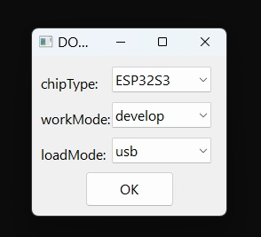
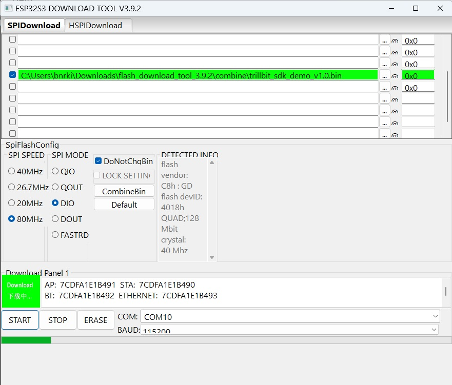
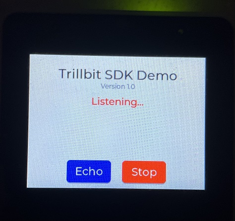

Trillbit SDK Demo on ESP32-S3-Box demonstrates how to use Trillbit SDK APIs. The demo also uses ESP-IDF and LVGL libraries.

# Setup Build Environment
## Software Requirements
- ESP-IDF: Trillbit SDK and Demo application uses v4.4 release of esp-idf, its repo can be found [here](https://github.com/espressif/esp-idf/tree/release/v4.4).
- ESP-DSP: Trillbit SDK library depends on esp-dsp, its repo and commit used can be found [here](https://github.com/espressif/esp-dsp/tree/8ec1402467a20b81dffedde30194e826419fe263).
- ESP-Box: Trillbit has modified the BSP layer of esp-box library to support 48kHz sample rate instead of the default 16kHz rate. Modified repo can be found [here](https://bitbucket.org/trillbitoutsourcedprojects/esp-box/src/bsp_sample_rate_48k/).
  
## Compile
Refer to [esp-box](https://github.com/espressif/esp-box#quick-start) Quick start guide to setup esp-idf and esp-box.

Below steps assume *esp-idf* is cloned in directory named *~/trillbit* and all its setup steps are finished.

```
$ cd ~/trillbit

$ git clone -b bsp_sample_rate_48k https://bitbucket.org/trillbitoutsourcedprojects/esp-box.git

$ git clone https://github.com/espressif/esp-dsp.git
$ cd esp-dsp
$ git checkout 8ec1402467a20b81dffedde30194e826419fe263
$ cd ..

$ git clone https://bitbucket.org/trillbitoutsourcedprojects/mtfsk-esp32-s3-box.git
$ git fetch --all --tags
$ git checkout tags/v1.0 -b sdk_demo

$ . esp-idf/export.sh

$ cd mtfsk-esp32-s3-box
$ idf.py -p </dev/tty?> build flash monitor
```

**NOTE**: Using the **flash** tool of idf will lead to full erase of *spiffs* partition which in-turn will cause deletion of any existing license file. If you want to preserve on-board *spiffs* contents while subsequent flashing, specify **app-flash** instead. If you already have a SDK license file in *spiffs* as part of source code then you can use **flash** or **app-flash** depending on your use-case.

## Flashing from Pre-built Binary - Windows

- Download the ESP32 flash tool from [here](https://www.espressif.com/sites/default/files/tools/flash_download_tool_3.9.3.zip)
- Pre-built demo binary is located in repo at *pre_built_bins\trillbit_sdk_demo_v1.0.bin*
- Run the flash tool and select start up settings as shown below



- Browse for the downloaded pre-built binary file and select SPI flash download settings as shown below
  


- Click *Start*. Once the download progress shows *Finish* status, reboot s3-box by pressing the *Reboot* switch (below USB connector).

# Licensing
License for the Trillbit SDK can either be downloaded from developer portal and stored in [spiffs](spiffs/README.md) partition or can be acquired over USB by running the License provisioning script.

## License over USB
### Setup Python Environment

Ensure you have python3 installed. Plug the USB-C cable to S3-Box and your PC. On power up you will see license missing message on the display of s3-box.

```
$ cd ~/trillbit
$ python -m venv py_env
$ . py_env/bin/activate
$ pip install pyserial
```
**NOTE: DO NOT share this program to customers. They should use online-backend based program to generate license.**

```
$ cd mtfsk-esp32-s3-box/scripts/license
$ python main.py
```

Follow the instructions given by the script.

# Using the Demo

On successful licensing, you would see the following SDK demo display



- Use the Mobile app to send data over sound.
- Received message would be displayed on the screen. Number prefixing the message increments for each received message.
- Tap *Echo* button to send back the last received message. If no last message is present then a default message would be sent.
- Tap *Stop* to stop and de-initialize the SDK.
- If stopped, tap *Start* to re-initialize the SDK to start receiving messages again.
- You can also view the console messages over USB/UART. Use the *monitor* tool of *idf*

  ```
  $ cd ~/trillbit
  $ . esp-idf/export.sh
  $ cd mtfsk-esp32-s3-box
  $ idf.py -p </dev/tty?> monitor
  ```
